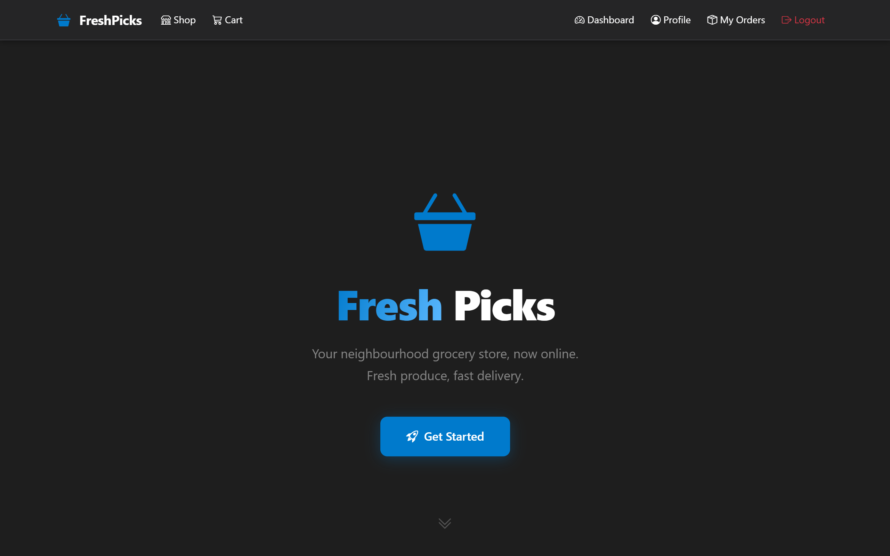
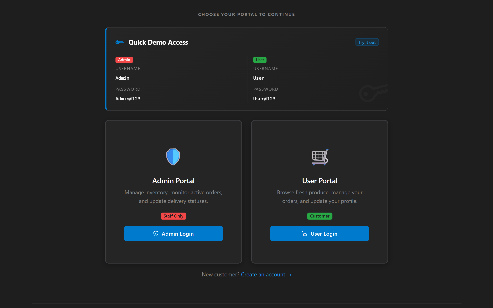
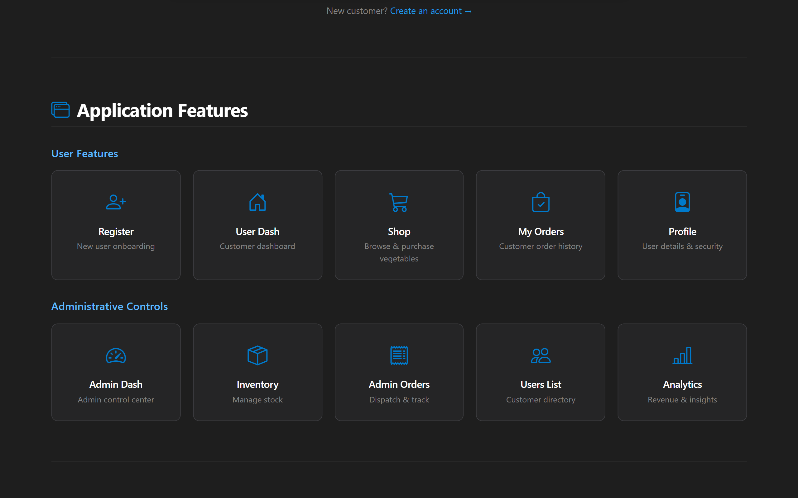
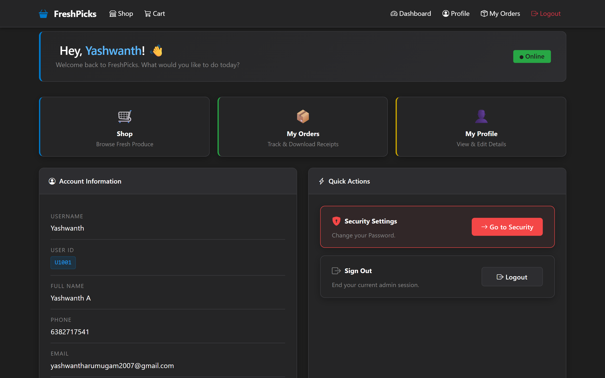
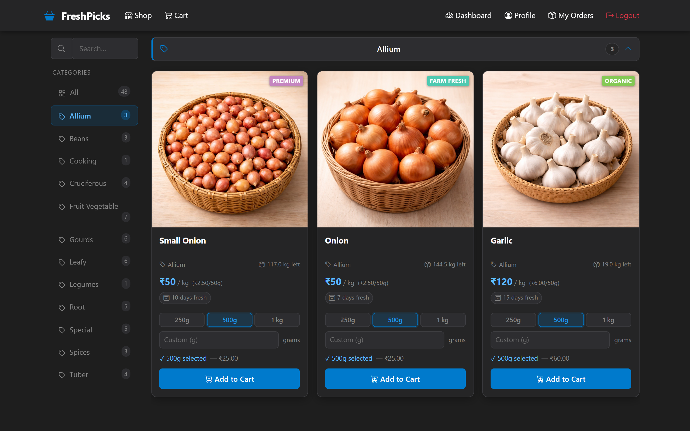
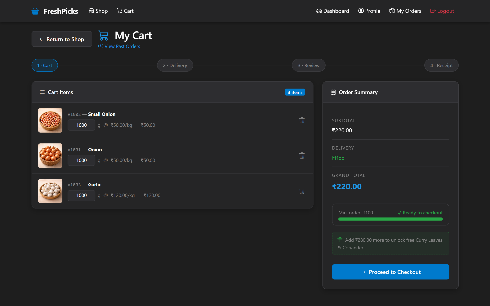
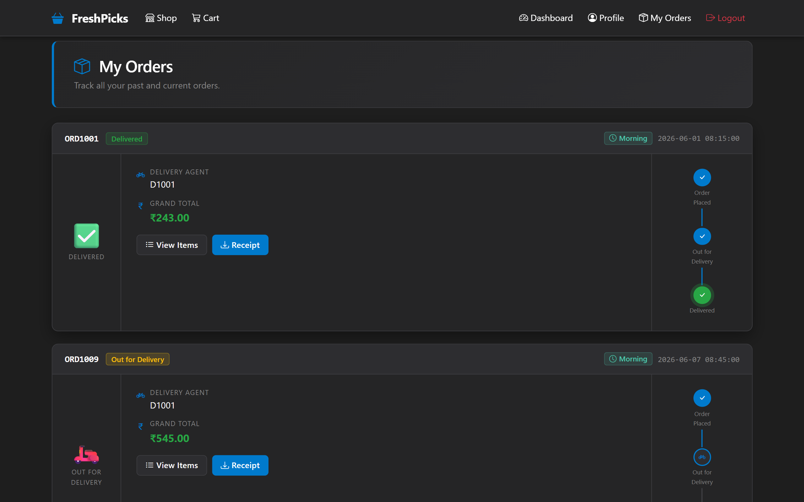
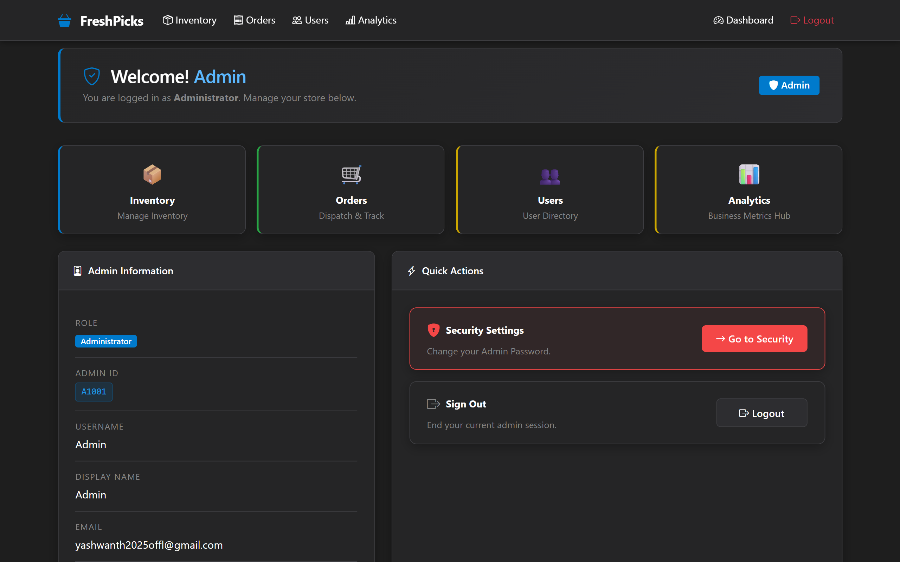
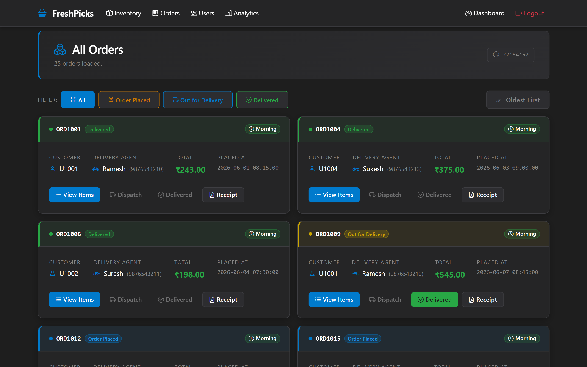
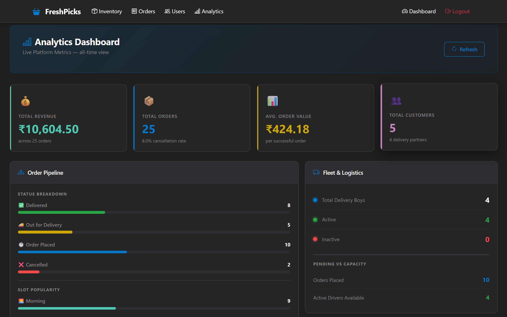

# 🧺 Fresh Picks

> Your neighbourhood grocery store, now online. Fresh produce, fast delivery.

[](https://python.org)
[](https://flask.palletsprojects.com)
[](https://supabase.com)
[](https://getbootstrap.com)
[](https://razorpay.com)
[](https://render.com)

**Live:** [https://fresh-picks-deploy.onrender.com](https://fresh-picks-deploy.onrender.com)

> ⚠️ Hosted on Render free tier. First load after inactivity may take ~30 seconds to wake up.

---

## Demo Access

| Role  | Username | Password    |
|-------|----------|-------------|
| User  | `User`   | `User@123`  |
| Admin | `Admin`  | `Admin@123` |

> OTP emails may land in spam on first receipt — mark as "Not Spam" to receive future emails correctly.

---

## About

Fresh Picks is a full-stack grocery e-commerce web application with separate customer and admin portals. Customers can browse a live vegetable catalogue, manage a cart, place orders via Razorpay, and receive PDF receipts by email. Admins can manage inventory, track and dispatch orders, view customer analytics, and get real-time order notifications.

---

## Features

### User Portal
- OTP-verified registration and login
- Browse full vegetable catalogue with live stock and pricing
- Cart management — add, update quantity, remove items
- 5-step checkout with Razorpay payment gateway
- Automatic PDF receipt emailed on successful order
- Order history with status tracking and receipt download
- Profile management and OTP-secured password change

### Admin Portal
- Live admin dashboard
- Inventory management — update stock, price, validity, and promo items
- Order management — slot-priority sorted dispatch view, status updates, agent assignment
- Batch slot promotion — flip all pending morning/afternoon/evening orders to "Out for Delivery"
- Real-time new order toast notification via Server-Sent Events (SSE)
- Customer directory with search and filter
- Revenue, slot distribution, inventory health, and staffing analytics

---

## Tech Stack

| Layer        | Technology                        |
|--------------|-----------------------------------|
| Frontend     | Vanilla JS, Bootstrap 5, Jinja2   |
| Backend      | Python, Flask (REST API)          |
| Database     | PostgreSQL via Supabase           |
| ORM          | SQLAlchemy                        |
| Payments     | Razorpay (HMAC-SHA256 validation) |
| Email        | SendGrid Transactional API        |
| PDF          | FPDF2                             |
| Hosting      | Render (PaaS)                     |

---

## Architecture

```
Browser  ──►  Flask REST API  ──►  SQLAlchemy ORM  ──►  PostgreSQL (Supabase)
         ◄──  JSON / HTML     ◄──                  ◄──
```

Flask serves both the rendered HTML pages (Jinja2 SSR) and a JSON REST API consumed by frontend JavaScript. All database operations go through SQLAlchemy. Static assets are served directly by Flask.

### Key Design Decisions

**Session-based auth** — Flask server-side sessions with SHA-256 hashed passwords. Plaintext credentials never touch the database.

**OTP flows** — Time-limited in-memory OTP store with TTL expiry guards registration, password change, and order cancellation.

**Server-Sent Events** — Admin dashboard maintains a persistent SSE connection. New orders push instant toast notifications to all connected admins without polling.

**Min-Heap dispatch** — Admin order view uses Python's `heapq` to sort orders by slot priority (Morning=1, Afternoon=2, Evening=3) on every load.

**Round-Robin delivery assignment** — Delivery agent assignment uses a `last_assigned` DateTime column. On each new order, the agent with the oldest assignment timestamp is selected — equitable distribution with zero in-memory state.

**Razorpay HMAC-SHA256** — Payment signatures are verified server-side before any order is committed. Client-side cart values are never trusted.

---

<!-- Add screenshots here -->
## Screenshots












---

## Running Locally

```bash
pip install -r requirements.txt
cp .env.example .env   # fill in your values
python seed.py
python app.py
```

The live version is deployed at [fresh-picks-deploy.onrender.com](https://fresh-picks-deploy.onrender.com) — no local setup needed to explore the app.

---

## API Reference

All endpoints return `{ "status": "SUCCESS" | "ERROR", ...data }`.

| Method   | Endpoint                                    | Description                        |
|----------|---------------------------------------------|------------------------------------|
| `POST`   | `/api/auth/login`                           | Login (user or admin)              |
| `POST`   | `/api/auth/logout`                          | Logout                             |
| `POST`   | `/api/auth/register`                        | Register (stages OTP)              |
| `POST`   | `/api/auth/register/verify`                 | Verify registration OTP            |
| `GET`    | `/api/users/me`                             | Get current user profile           |
| `PATCH`  | `/api/users/me`                             | Update profile field               |
| `PATCH`  | `/api/users/me/password`                    | Change password (OTP required)     |
| `GET`    | `/api/products`                             | List all products                  |
| `GET`    | `/api/cart`                                 | View cart                          |
| `POST`   | `/api/cart/items`                           | Add item to cart                   |
| `PATCH`  | `/api/cart/items/<item_id>`                 | Update cart item quantity          |
| `DELETE` | `/api/cart/items/<item_id>`                 | Remove cart item                   |
| `POST`   | `/api/checkout/razorpay-order`              | Create Razorpay order              |
| `POST`   | `/api/checkout/verify`                      | Verify payment and commit order    |
| `GET`    | `/api/orders`                               | Get user order history             |
| `GET`    | `/api/orders/<order_id>/receipt`            | Download PDF receipt               |
| `GET`    | `/api/admin/orders`                         | List all orders (admin)            |
| `GET`    | `/api/admin/orders/stream`                  | SSE stream for new order alerts    |
| `PATCH`  | `/api/admin/orders/<order_id>/status`       | Update order status                |
| `PATCH`  | `/api/admin/orders/<order_id>/agent`        | Assign delivery agent              |
| `GET`    | `/api/admin/inventory`                      | Get full inventory (admin)         |
| `PATCH`  | `/api/products/<veg_id>`                    | Update product stock               |
| `GET`    | `/api/admin/users`                          | List users (admin)                 |
| `GET`    | `/api/admin/analytics`                      | Get analytics data                 |

---

*Built with Flask, PostgreSQL, and Bootstrap 5.*
